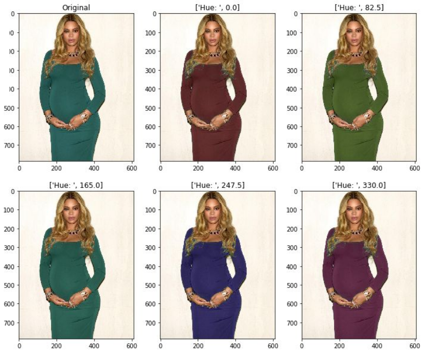

# Clothing Color Changer
This was a group project in my third bachelor semester. The goal was to get to know machine learning and neuronal networks in practice.  
We wanted to create a python program which would be able detect people on a picture and would be able to change the color of their clothing. This could be useful for colorblind people and sports events, where the color of a jersey is important.

The software uses MaskRCNN with semantic segmentation to first isolate the pixels of each person on a picture. It then finds the most prominent color in each of these areas to then transform this specific hue within this area. All this is possible through a GUI. 



## Setup instructions
These instructions are for Windows only.

Clone this project (make sure you have included GIT LFS files) and make sure you have installed Python 3.


Open the command prompt and run the following command:

```
pip3 install https://storage.googleapis.com/tensorflow/mac/cpu/tensorflow-1.4.0-py3-none-any.whl opencv-python numpy scipy matplotlib cython pyqt5==5.7.1 Keras==2.0.9
```

Install the Visual C++ Build Tools by running the .exe file in the `additional_installation_files` directory.

Copy the `cocoapi-master` directory from the same folder as above into the `scripts`-folder in your Python installation directory.

Open the command prompt within `Python installation directory/cocoapi-master/PythonAPI` and run the following commands: 

```
python setup.py build_ext --inplace
python setup.py build_ext install
```

Now everything should be set up. You can now run the demo by running the `main.py` file.
